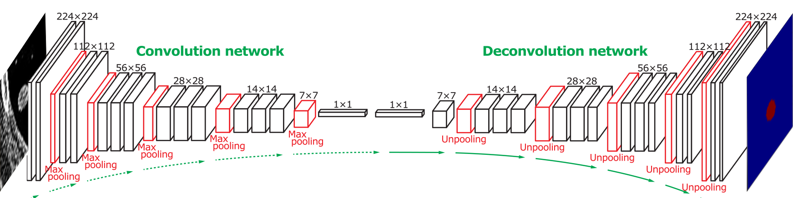

# PNDC
**Pulmonary Nodule Detection & Classification**
```
 Extra Codes Will be updated soon!
 ```
Lung Cancer Diagnosis Algorithm in Patients with Isolated Pulmonary Nodules in Computed Tomography image of the Chest Using Deep Learning

\ | Details
 :-: | :-----:
 **Abstract** | Deep neural network to detect isolated nodules, which classify whether nodule is cancer or not from chest CT(computed tomography) images. In this project, deep neural network is based on CNN including Deconvolution layers and unpooling layers for classification and segmentation.
 **Network** |  
 **Demo** | <b>Original&nbsp;&nbsp;&nbsp;&nbsp;&nbsp;&nbsp;&nbsp;&nbsp;&nbsp;&nbsp;&nbsp;&nbsp;&nbsp;&nbsp;&nbsp;&nbsp;&nbsp;&nbsp;&nbsp;&nbsp;&nbsp;&nbsp;&nbsp;&nbsp;&nbsp;&nbsp;&nbsp;&nbsp;&nbsp;&nbsp;&nbsp;&nbsp;&nbsp;&nbsp;&nbsp;&nbsp;&nbsp;&nbsp;&nbsp;&nbsp;&nbsp;&nbsp;&nbsp;&nbsp;&nbsp;&nbsp;&nbsp;&nbsp;&nbsp;&nbsp;&nbsp;&nbsp;&nbsp;&nbsp;&nbsp;Predicted</b></br>    
 **Dataset** | **[LIDC-IDRI](https://wiki.cancerimagingarchive.net/display/Public/LIDC-IDRI)**<br/>The Lung Image Database Consortium image collection (LIDC-IDRI) consists of diagnostic and lung cancer screening thoracic computed tomography (CT) scans with marked-up annotated lesions. It is a web-accessible international resource for development, training, and evaluation of computer-assisted diagnostic (CAD) methods for lung cancer detection and diagnosis. Initiated by the National Cancer Institute (NCI), further advanced by the Foundation for the National Institutes of Health (FNIH), and accompanied by the Food and Drug Administration (FDA) through active participation, this public-private partnership demonstrates the success of a consortium founded on a consensus-based process.

## Requirements
- **Python ≥ 3.5**
- **Tensorflow ≥ 1.5.0**
- **Caffe = 1.0.0**
- **Numpy ≥ 1.14.3**
- **Tqdm ≥ 4.19.9**
- **LMDB ≥ 0.94**

## Citations - for Accuracy comparison
[1] Armato III, Samuel G., McLennan, Geoffrey, Bidaut, Luc, McNitt-Gray, Michael F., Meyer, Charles R., Reeves, Anthony P., … Clarke, Laurence P. (2015). Data From LIDC-IDRI. The Cancer Imaging Archive.

[2] Y.Lee, T. Hara, Fujita, S.Itoh, and T. Ishihaki. "Automated detection of pulmonary nodules in helical CT images based on an improved temlate maching technique", IEEE Trans. Med. Imaging, vol.20, pp. 595-604, 2001.

[3] A. Farag, A. El-Baz, G. G. Gimelfarb, R. Falk, and R. S. Hushek, "Automatic detedction and recognition of lung abnoralities in helical CT images using deformable templates,"in Lecture Notes in Computer Science, Medical Image Computing and Computer Assisted Intervention, vol. 3217, New York: Springer-Verlag, pp. 856-864, 2004.

[4] Madero Orozco, H; VergaraVillegas, O.O. ; De jesus Ochoa Dominguez, H. ; Cruz Shanchez, V.G, "Lung Nodule Classification in CT Thorax Images Using Support VectorMachines", Artificial Intelligence (MICAI) 12th Mexican International Conference, pp. 277-283, 2013.

[5] Zihao Lua,  Marcus A. Brubaker, Michael Brudno. "Size and Texture-based Classification of Lung Tumors with 3D CNNs", 2017 IEEE Winter Conference on Applications of Computer vision, 806-814, 2017.
